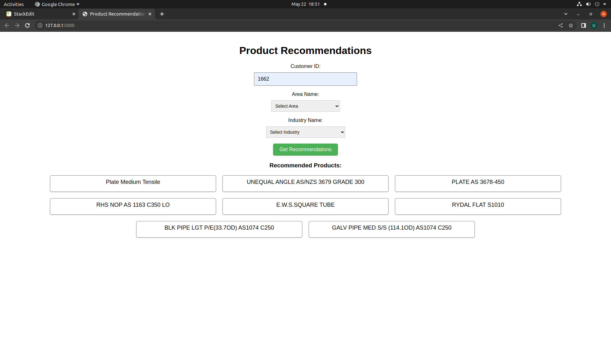

# Product Recommendation System

The Product Recommendation System is a software application that utilizes machine learning algorithms to provide personalized product recommendations to users. This README file provides an overview of the system, its features, installation instructions, and usage guidelines.

## Table of Contents

-   [Features](#features)
-   [Installation](#installation)
-   [Usage](#usage)
-   [Contributing](#contributing)
-   [License](#license)

## Features

The Product Recommendation System offers the following features:

1.  **Personalized Recommendations:** The system analyzes user preferences and behavior to generate personalized product recommendations based on their interests, past purchases, ratings, and browsing history.
    
2.  **Multiple Recommendation Strategies:** The system employs various recommendation strategies, including collaborative filtering, content-based filtering, and hybrid approaches, to provide diverse and accurate recommendations.
    
3.  **Scalability:** The system is designed to handle large datasets and can scale effectively to accommodate growing user bases and product inventories.
    
4.  **Real-time Updates:** The recommendation engine continuously adapts and updates recommendations based on user interactions and new product data, ensuring the latest and most relevant recommendations are provided.
    
5.  **User Feedback Incorporation:** The system allows users to provide feedback on the recommendations they receive, which can be used to further improve the accuracy and relevance of future recommendations.
    
6.  **API Integration:** The system provides an API that allows seamless integration with existing applications and platforms, enabling easy implementation of the recommendation functionality.
    

## Installation

To install and run the Product Recommendation System, follow these steps:

1.  Clone the repository from GitHub:
    ```
    git clone https://github.com/Uttampatel1/Product-Recommendation-System.git
    ```
    
2.  Navigate to the project directory:
    
 
  ``` 
  cd recommendation-system
  ```
    
3.  Install the required dependencies. It is recommended to use a virtual environment:
    
    code
    
    ```python -m venv venv
    source venv/bin/activate (for Linux/Mac)
    venv\Scripts\activate.bat (for Windows)
    pip install -r requirements.txt
    ```
    
4.  Configure the system by modifying the configuration files to suit your environment and requirements. This may include specifying the data sources, algorithm settings, and other parameters.
    
5.  Run the application:
   
    ```
    python main.py
    ```
    
6.  Access the application by navigating to `http://localhost:5000` in your web browser.
    
## Demo



## Contributing

Contributions to the Product Recommendation System are welcome! If you would like to contribute, please follow these steps:

1.  Fork the repository on GitHub.
    
2.  Create a new branch for your feature or bug fix.
    
3.  Make the necessary changes and commit your code.
    
4.  Push your branch to your forked repository.
    
5.  Submit a pull request with a detailed description of your changes and the problem they solve.
    

## License

The Product Recommendation System is released under the [MIT License](https://chat.openai.com/LICENSE). You are free to use, modify, and distribute the software according to the terms and conditions of the license.

----------

Thank you for using the Product Recommendation System! If you have any questions or encounter any issues, please feel free to contact us at
